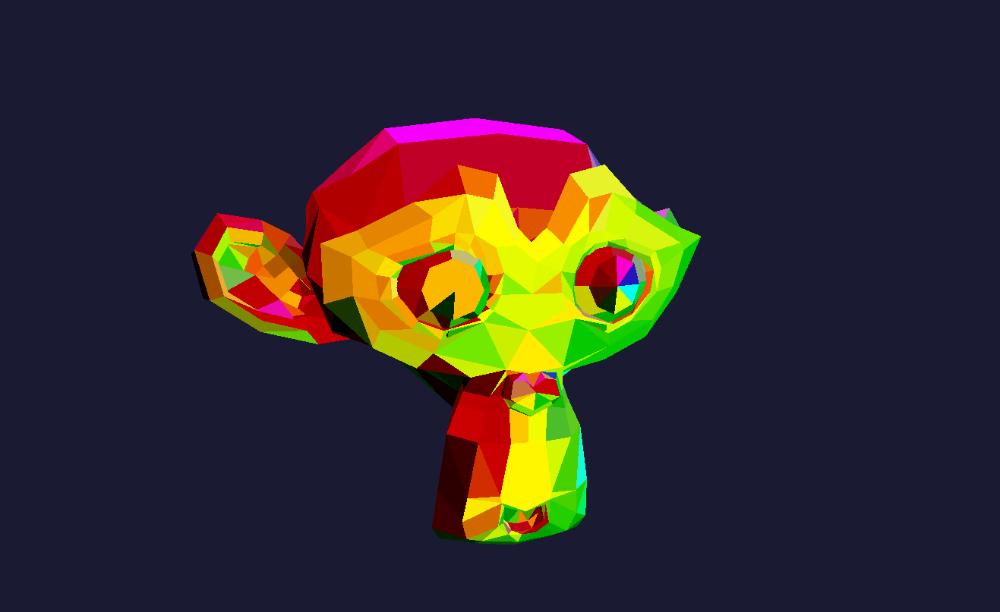

# scop
```
42 school project that parses a wavefront .obj and renders it using OpenGL4.6 and C++17.

No librairies were allowed except one for handling the window (I used GLFW).
```



### Usage
```
./scop $path_to_object_model
```
### Keyboard inputs
```
Move camera: by using the keyboard ARROWS
Zoom camera: with the mouse wheel
Rotate model: by moving the mouse or pressing X or Y or Z
Change texture: press T
Toggle colour mode: press C
Modify colour moving speed: press , or .
Toggle greyscale mode: press G
Toggle flat mode: press F
Change to filled mode: press 1
Change to lined mode: press 2
Change to dotted mode: press 3
Quit: press ESC
```
